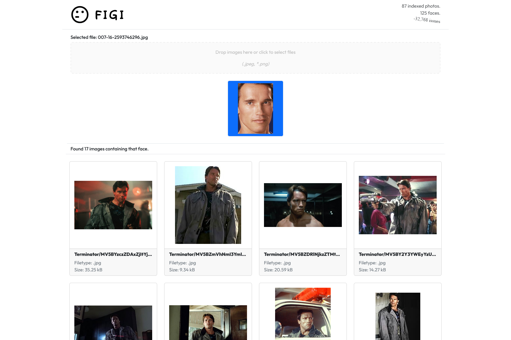

# Figi

Figi (fig-ghee) is a local-first face search engine, backed by SFace & YuNet via OpenCV. It has a FastAPI (Python) backend and a React frontend, which use GraphQL to communicate.

## Demo

<a href="https://figi.litmuspaper.art/">
</img>
</a>

> :warning: Disclaimer: I have never watched Terminator, but it is the primary (and obligatory) pop-culture reference for this project. Sorry if I get anything wrong, :).

## Description

Figi is a local-first face search engine. It takes a folder full of images, indexes them, and then allows you to search for faces in those images.

It is split into two repos: [the backend](https://github.com/elijahfhopp/figi-backend) and [the frontend](https://github.com/elijahfhopp/figi-frontend). Both are included as submodules in this repo, and each has information on its respective setup process.

## Background

Figi is a portfolio project and a learning project. It is not currently intended to be a fully-featured utility. I hadn't worked with AI stuff, GraphQL, pgvector, or React before this. It was a great learning experience and I am sure it will pay dividends in the future.

I spent about 60 hours building it. There were lots of new things and I am actually relatively pleased with how it came out.

## NOTES.md, REFERENCES.md, & plans

- `NOTES.md`: A file with some technical notes on certain elements of the application.
- `REFERENCES.md`: A file with blurb + link format, noting some of the resources I used in the programming process.
- `plans/`: A folder with some early-stage plans on what I wanted the project to be.

## Project Tech Review

I thought I would review a number of bits of tech I used for Figi. The ratings overall seem quite high, but I genuinely enjoyed the tech I got to work with on this project.

### Frontend

#### Apollo Client - Yeah, I'd try it again.

This was one piece that I felt I was using wrong. I was using raw `gql` expressions and `use[Lazy]Query()`. Thus there's no typing and no GraphQL specs on the frontend. The docs got me far enough with the `ApolloProvider` and basic examples to call it good enough. The docs were difficult to navigate, but workable. I ran into an odd issue where Apollo was trying to send a `number[]` as a `string` and it was being rejected by the server, so I worked around it on the backend (because I couldn't find similar issues online). Otherwise, the API felt like it was almost React-standard.

- Experience: 6.75/10
- Docs: 6/10
- Perceived Value: 8.5/10 - seems like a properly complete ecosystem.

#### React - Industry standard for a good reason.

React took a bit to get my head around. Frankly, the whole JS multiverse is rather confusing. Everyone is promising they are a great way to build a front end, but sometimes it's really hard to tell what piece of the ecosystem a library fits into. "Is Astro comparable to Remix, or is it like Vite? No, I know Vite is a webpacker, but does it use React or does it replace it? Wait, it uses a webpacker and also uses Node? What?" This kind of thing has kept me away from the ecosystem for quite a while. But "now" is always the time to dive in.

React itself has quite the learning curve. I didn't realize how steep it was. Looking back, I think more reading before going hands-on would have been helpful. But that is not my style, :D. There are a number of things you have to get your head around, but once it clicks, the DevEx is pretty good. I understand why it is so widely adopted. And, honestly, I have yet to be convinced that there is a such thing as a "good" UI paradigm/framework/library. Good thing I know I am not the person who should try and fix it.

- Experience: 7/10
- Docs: 8/10
- Perceived Value: 9/10

#### Bootstrap/react-bootstrap - Something about affinity and a black hole, or is that infinity?

I have used Bootstrap before, so I was somewhat familiar with the basic concepts. It is a pretty complete set of design tools. Since utility and the ability to put "paint" on the "canvas" came first, I didn't mind if I fell into the pit of "Oh, this is a Bootstrap website". The Bootstrap docs are excellent. react-bootstrap was useful, but I often found myself having to add various classNames to components. Still, I got some miles out of it (even if I was doing it wrong).

Bootstrap:
- Experience 8.5/10
- Docs: 9/10
- Perceived Value: 6.75/10

react-bootstrap:
- Experience: 6/10
- Docs: 8/10
- Perceived Value: 6/10

P.S. It's `align-items-center` and `justify-contents-center`. `justify-items-center` is just in your mind. It's a hard truth, but you have to know.

#### Vite - Ironically reminiscent of a _slow_-cooker.

Setting up a project with Vite was really easy. The template had everything VS Code wanted, which was great. The corelation between good DevEx and dopamine levels can't be ignored. The longer I sat with it, the more I liked it. It was like any good build tool: nearly invisible and completely forgettable. You can read about my path fiasco in [figi-frontend](https://github.com/elijahfhopp/figi-frontend)'s README.

- Experience: 9/10
- Docs: 7.5/10
- Perceived Value: 9/10 

### Backend

#### FastAPI - They should call it "Oh-my-gosh-where's-the-server-code-it's-so-miniscule-wowAPI".

Ok, maybe "WowAPI" is better. I genuinely can't express how much I love FastAPI. I am not sure about that 10% of truly advanced usage, but I don't know what could possibly be easier for 90% of cases. It is very Pythonic and although I haven't needed it, `uvicorn` is apparently quite performant. The file-watch/reload is lighting-quick and a lifesaver for the `F5` finger.

- Experience: 10/10 - :heart:
- Docs: 9/10 - I wanted more detail on what `UploadFile` expects.
- Perceived Value: 9/10 - It may not be what everyone needs.

#### Postgres/pgvector - "My missionaries in a foreign varchar(5) references viva(la_vida)" - Coldplay, I think.

I had great experiences with both. pgvector's Docker container has basically no docs, but it's literally just the `postgres` image with pgvector installed. The pgvector Peewee integration actually worked, despite my doubts. Postgres is The Database in 2024. I wasn't doing anything crazy, so it was the ideal choice.

Postgres: 10/10 until I figure out how to inevitably break it.

pgvector:
- Experience: 9/10
- Docs: 6/10
- Perceived Value: 9/10

#### Peewee - "It's actually, orm, kinda a big deal."

Peewee's small. If you need a big, fancy ORM, you need one. If you don't, you need Peewee. I still don't know if I am managing db connection with it properly, but I'll leave that to the reader's discretion. Model description is easy. Indexing is simple. I used the Pydantic integration on a previous project without issues. There's not much to hate, aside from the lack of auto-complete/type-hinting when writing SQL queries.

- Experience: 8/10
- Docs: 8.5/10
- Perceived Value: 9/10

#### Strawberry - Best fruit-inspired lib I have used so far, :strawberry:.

I really like Strawberry. Although it's simple, it doesn't entirely lacking flexibility or extensibility. The FastAPI integration was a dream, honestly. It really did plug and play. The docs were not as complete as I would have liked, but it worked out with some testing. I didn't run into any odd behavior and the type-hinting made writing with it easy. Next time around I want to try the experimental Pydantic integration.

- Experience: 9/10
- Docs: 5/10 - Pretty, but lacking depth.
- Perceived Value: 8/10

#### cv2-python - It's a bird, it's a plane--no, it's a MatLike with no metadata.... So both? Neither?

OpenCV is an invaluable tool. Nevertheless, it can really feel like a C++ library sometimes. The reality of sketch array iteration and "Which function does this int flag const go to?" is felt sometimes. The Python wrapper is surprisingly robust (functionality- and stability-wise). The fact it supported SFace and YuNet was a nice surprise and was a key element of this project.

- Experience: 8/10
- Docs: 8/10
- Perceived Value: 8/10

---

**Figi is public domain software developed in an AI-free, pasture environment by an Elijah who has been read his rights.**